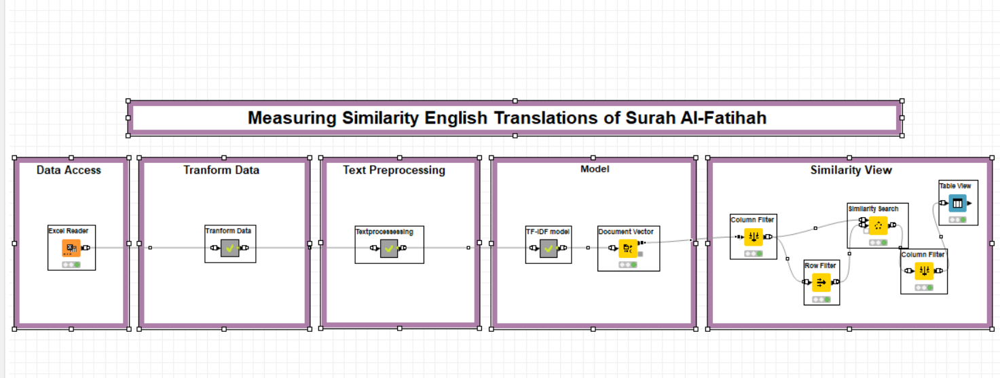

# codeless data mining
# Measuring similarity English translations of Surah Al-Fatihah using computational calculation methods.
 
## Overview
   The Qur'an has been translated in many different versions by using different translation sentence. For example, the word Allah has more than one translation. Some translate to “God” some translate to “Lord”.

   In this project, I would like to know whether the translations are similar or not. By measuring the similarity of Surah Al-Fatihah ( The opening) using four models; text processing , Term Frequency-inverse Document Frequency or TF, IDF and cosine Similarity.

## Tools of use
- a computer
- Knime Analytics Platform
- Ecxel
- GitHub, GitHub Desktop

## package in need
- Textproccessing (in knime)
 
## Steps to do
- Data Access 
- Tranform Data
- Text preprocessing
- Create model 
- View the result

###  Data Access 

Use the excel file in the datasets folder of this repository

  

###  Tranform Data

Tranpose data 

###  Text preprocessing

###  Model 

###  Use TF-IDF model to calculate weight of words

  
###  Cosine similarity

## # Use cosine similarity to see similarity or distance between documents

# Conclusion
  

 
