# Compare Similarity for 14 translater in Surah (Al-Fatihah)
 
## Overview
This is a text mining project to determine that Surah(Al-Fatihah) is also be Al-Fatihah even translate different 14 translater.But as a computer,it does not know what is Surah(Al-Fatihah). So, this project is about to teach computer to understand about Al-Fatihah with text mining with some mathematical metrix through codeless mining tool.

    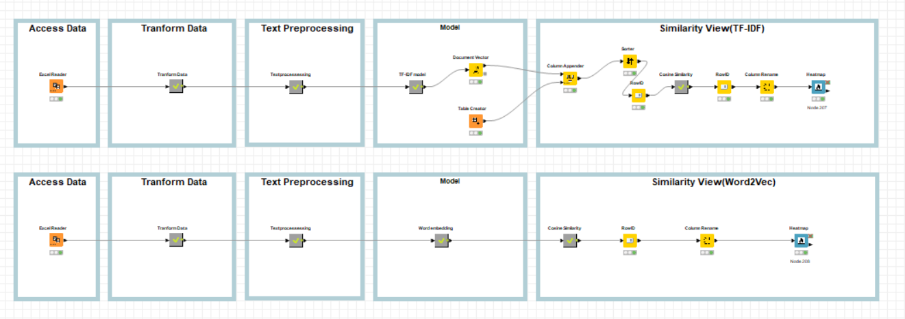

## Data (Alquran english translation)
- Dr. Mustafa Khattab, the Clear Quran
- Fadel Soliman, Bridges’ translation
- Maarif-ul-Quran
- Mufti Taqi Usmani
- Dr. Ghali
- Abdul Haleem
- Tafheem-ul-Quran - Abul Ala Maududi
- English Translation (Pickthall)
- English Translation (Yusuf Ali)
- Ruwwad Center
- Dr. T. B. Irving
- Muhammad Taqi-ud-Din al-Hilali &amp; Muhammad Muhsin Khan
- Maulana Wahiduddin Khan
- Ibn_Kathir 

## Methodology

### Model
#### 1.[Term Frequency-Inverse Document Frequency (tf*idf)](https://en.wikipedia.org/wiki/Tf–idf)
#### 2.[Cosine Similarity](https://www.geeksforgeeks.org/cosine-similarity/)
#### 3.[Word2Vec](https://towardsdatascience.com/word2vec-explained-49c52b4ccb71)
#### 4.Text Preprocessing
 - Tokenized(tokenize all words)
 - Stopwords(clean all stopwords)
 - Tagger(tag the words according to dictionary)
 - lemmatization(change the words to their root words)

### Tools of use
- Knime

### package in need
- Textproccessing (in knime)
 
### Steps
- Access Data
- Tranform Data
- Text preprocessing
- Model
- Measure similarity

#### Access Data
use the excel file in the datasets folder of this repository

#### Tranform Data

    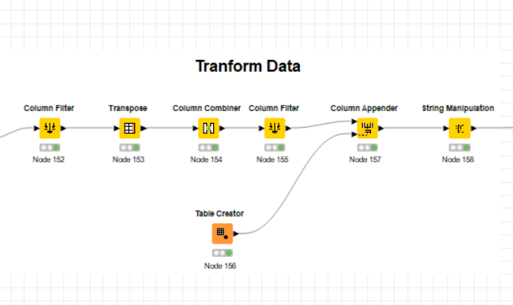

### Text preprocessing

#### For TF-IDF

    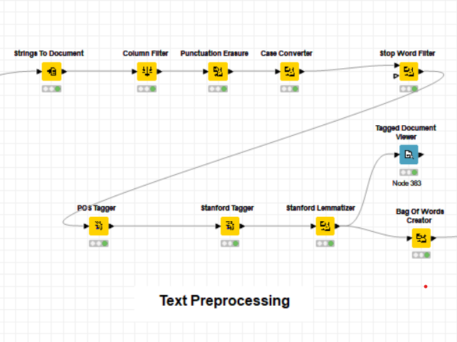

#### For Word2Vec

    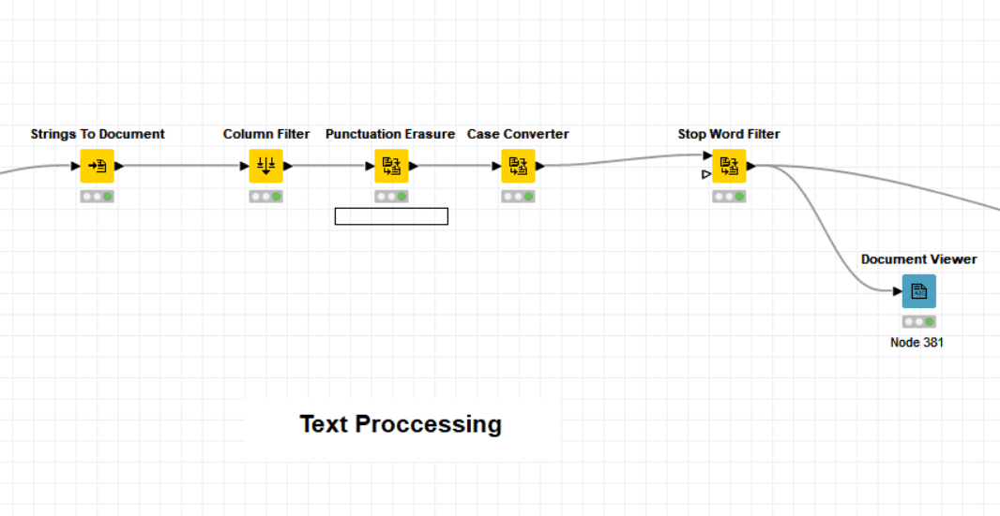

### Model 

#### TF-IDF

    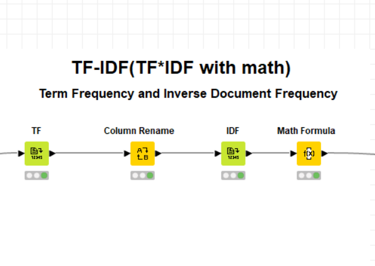

#### Word2Vec

    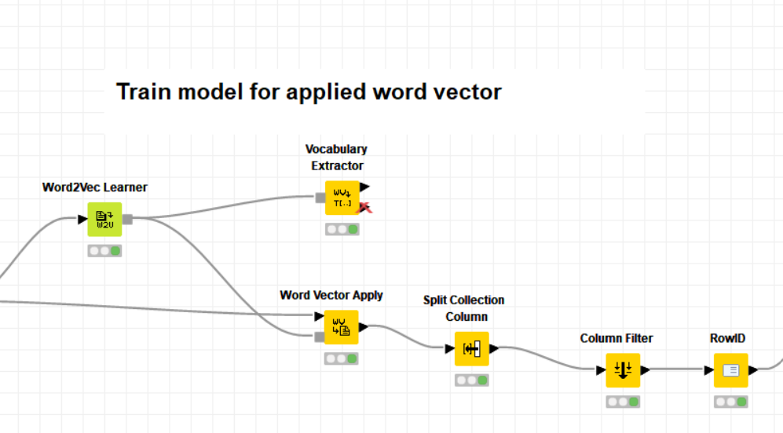

### Measure similarity

    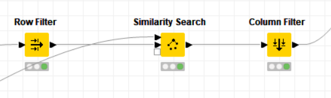

## Results
### Access data

    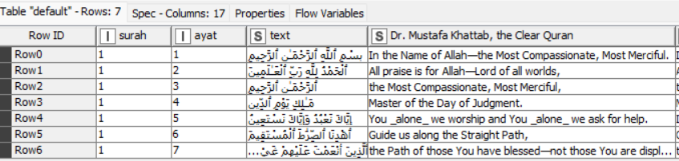

### Tranform data

    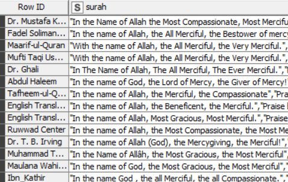

### Text Preprocessing
#### In TF-IDF

##### after preprocessing

    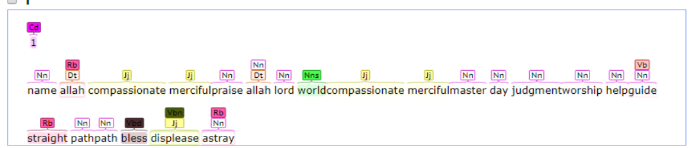

##### Bag of Word

    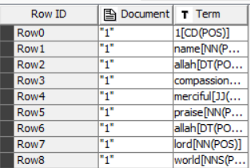

#### In Word2Vec
##### after preprocessing

    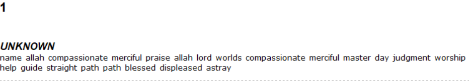

### Model
#### TF-IDF

    

##### Document vector

    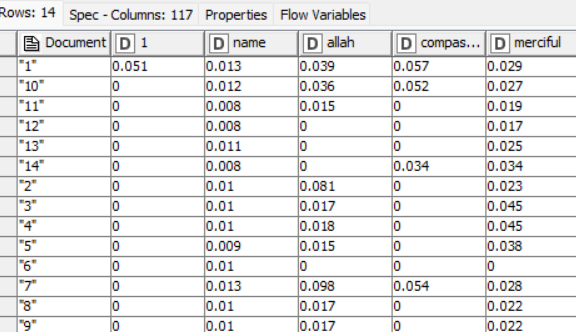

#### Word2Vec
##### Vocabulary

    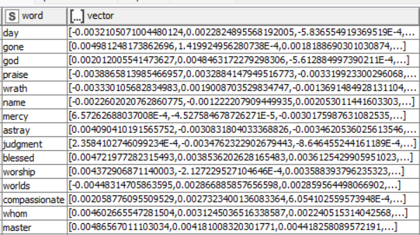

#### Document vector

    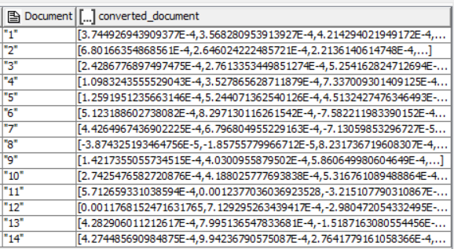

### Mesure Similarity
#### Mesure TF-IDF model

    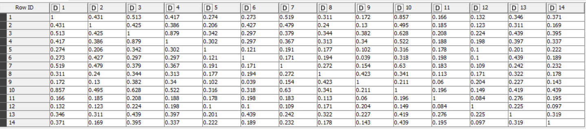

##### Heatmap(TF-IDF)

    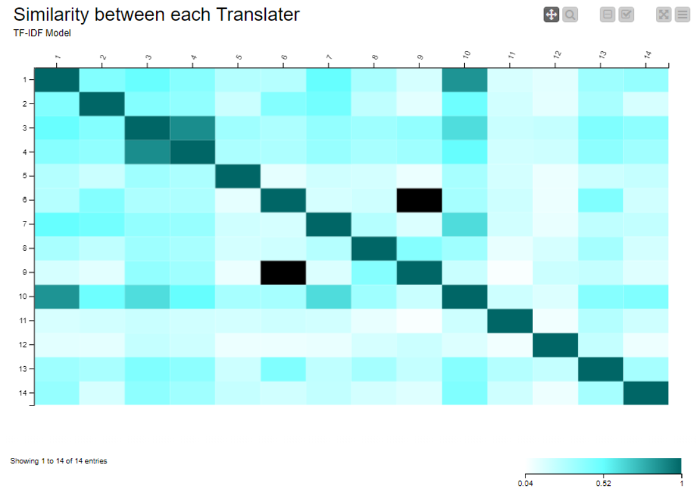

####  Mesure Word2Vec model

    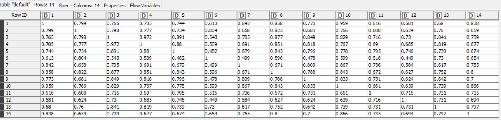

##### Heatmap(word2vec)

    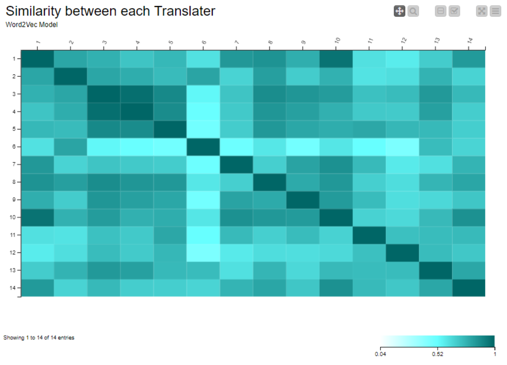

## Conclusion
   In this project, i use  TF-IDF and Word2Vec to create weight frequecy of words to measure
   the distance between 14 documents of surah Al-fatihah with cosine similarity. For conclusion, 
   we can see Word2Vec model give better result than TF-IDF model. TF-IDF model is only calculate
   weight of words depend on its appearance but Word2Vec model train the words to find relation
   with word vector.

## Suggestion
    TF-IDF model is suit for detect the documents(copy). And must use with other semantic model 
    and some dictionary such wordnet, glove to get better result.
    Word2Vec model is neutual network model so we must use large amount of dataset.
