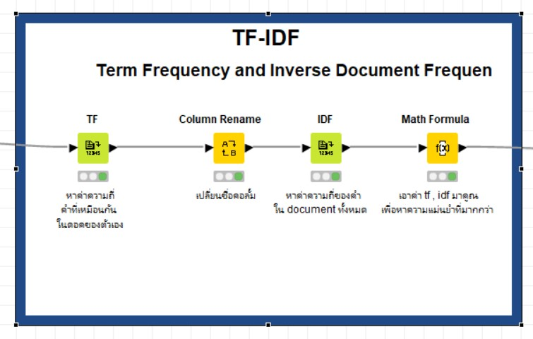
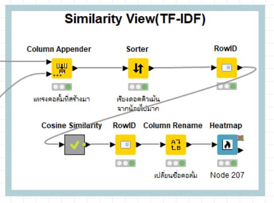
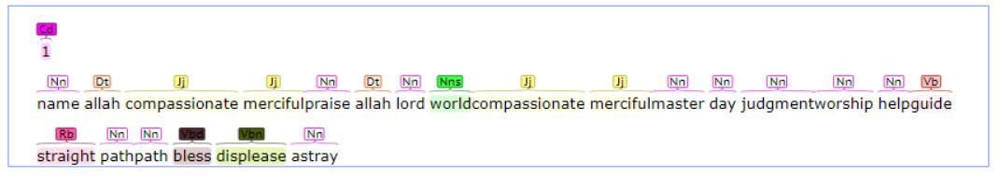

# Compare Similarity for 14 translater in Surah Al-Fatihah
 
## Overview
   This is a text mining project to determine that Surah(Al-Fatihah) is also be Al-Fatihah even translate different 14 translater.But as a computer,it does not know what is Surah(Al-Fatihah). So, this project is about to teach computer to understand about Al-Fatihah with text mining with some mathematical metrix through codeless mining tool.

## Methodology
### Tools of use
- a computer
- Knime Analytics Platform
- Ecxel
- GitHub, GitHub Desktop
### package in need
- Textproccessing (in knime)

### Steps to do

  

- Data Access 
- Tranform Data
- Text preprocessing
- Create model 
- View the result

####  Data Access 

Use the excel file in the datasets folder of this repository

  

####  Tranform Data

  

- Use Column filter node to remove unused column(surah,text,ayat)
- Use Tranpose node to tranpose data 
- Use Column combiner to combine 7 columns into a single column.
- Use Column filter node to remove unused column(all column except new column)
- Use Column Appender node to create new id
- Use String Manipulation node to remove -

####  Text preprocessing

  

- Use String to Document node to change string to document
- Use Column filter node to remove unused column
- Use Punctuation Erasure to remove punctuation (? ! , . () , : ; "")
- Use case convertor node to change all character to be lowercase letter
- Use Stop Word Filter node to remove stop word
- Use POS Tagger node ,Stanford node to separate word Part of speech(nouns,verbs, adverb etc.)
- Use Standford Lammatizer node to make the verb to be base form
- Use Bag of Word Creator node to create bag of word

####  Model 

  

- Use TF-IDF node to be Model
- Use Math Formula node for calculate(TF*IDF)
- Use TF-IDF model to calculate weight of words

  
###  Cosine similarity

  

## Result

#### Result of Data access

  

#### Result of Tranform Data 

  

#### Result of Text Processing 

  

#### Result of TF

  

#### Result of IDF

  

#### Result of cosine similarity

  

#### Result of cosine similarity to see similarity  between documents

  

  

# Conclusion

# Suggestion

  

 
