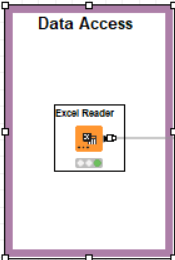
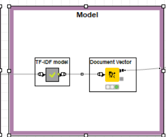

# codeless data mining
## Overview
   The Qur'an has been translated in  different versions by using different translation sentence. For example, the word Allah has more than one translation. Some translate to “God” some translate to “Lord”.

   In this project, I would like to know whether the translations are similar or not. By measuring the similarity of Surah Al-Fatihah ( The opening) using four models; text processing , Term Frequency-inverse Document Frequency or TF, IDF  Similarity.
 
### Tools of use
- a computer
- Knime Analytics Platform
- Ecxel
- GitHub, GitHub Desktop
 
### package 
Textproccessing (in knime)

### Steps to do

  

- Data Access 
- Tranform Data
- Text preprocessing
- Create model 
- View the result

## DATA ACCESS

  

## TRANFORM DATA

  

## TEXT PROCESSING

  

## MODEL

  

## View

  

