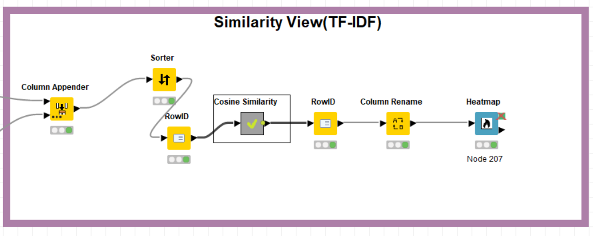

# codeless data mining
# Measuring similarity English translations of Surah Al-Fatihah using computational calculation methods.
 
## Overview
   The Qur'an has been translated in many different versions by using different translation sentence. For example, the word Allah has more than one translation. Some translate to “God” some translate to “Lord”.

   In this project, I would like to know whether the translations are similar or not. By measuring the similarity of Surah Al-Fatihah ( The opening) using four models; text processing , Term Frequency-inverse Document Frequency or TF, IDF and cosine Similarity.

## Methodology
### Tools of use
- a computer
- Knime Analytics Platform
- Ecxel
- GitHub, GitHub Desktop
### package in need
- Textproccessing (in knime)

### Steps to do

  

- Data Access 
- Tranform Data
- Text preprocessing
- Create model 
- View the result

####  Data Access 

Use the excel file in the datasets folder of this repository

  

####  Tranform Data

  

- Use Column filter node to remove unused column(surah,text,ayat)
- Use Tranpose node to tranpose data 
- Use Column combiner to combine 7 columns into a single column.

  

- Use Column filter node to remove unused column(all column except new column)
- Use Column Appender node to create new id
- Use String Manipulation node to remove -

####  Text preprocessing

  

- Use String to Document node to change string to document
- Use Column filter node to remove unused column
- Use Punctuation Erasure to remove punctuation (? ! , . () , : ; "")
- Use case convertor node to change all character to be lowercase letter
- Use Stop Word Filter node to remove stop word
- Use POS Tagger node ,Stanford node to separate word Part of speech(nouns,verbs, adverb etc.)
- Use Standford Lammatizer node to make the verb to be base form

  

- Use Bag of Word Creator node to create bag of word

####  Model 

  

- Use TF-IDF node to be Model
- Use Math Formula node for calculate(TF*IDF)
- Use TF-IDF model to calculate weight of words

  
###  Cosine similarity

  

## Result

#### Result of TF

  

#### Result of IDF

  

#### Result of cosine similarity

  

#### Result of cosine similarity to see similarity  between documents

  

  

# Conclusion

# Suggestion

  

 
